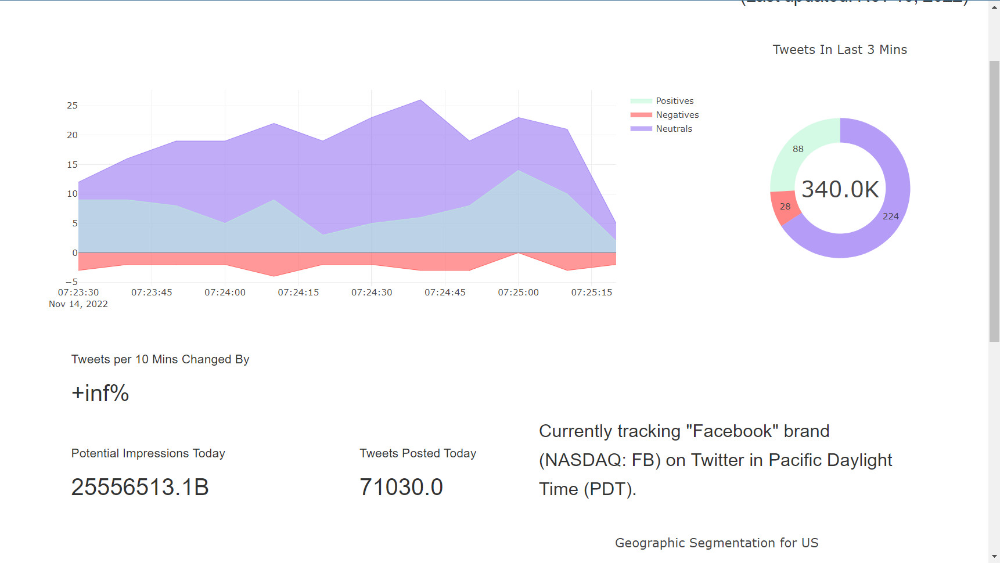

# Tweet-Visualization-and-Sentiment-Analysis-in-Python

## Architecture 

Here we use Twitter API to ingest data, from "Facebook" topic. Then we store it in Realtime Database Firebase.  
We have a dashboard website hosted in AWS EC2 that consume data from Realtime database to visualize it.  

## Technology

- Twitter API
- Firebase Realtime Database
- AWS EC2
- Python (Flask)

## Homepage

